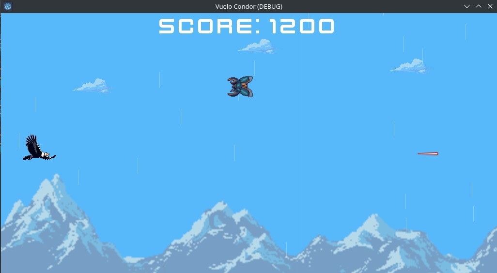

# Juego Runner con GODOT

Sencillo juego Runner en donde un condor debe destruir enemigos para obtener el máximo puntaje

Herramientas utilizadas:

- [Godot 4.2.1](#)
- [GIMP 2.10](#)

### Estructura del proyecto Vuelo Condor

```
|- res://
|   |
|   |- assets/                       // carpeta con los recursos utilizados en el juego
|   |- scenes/                       // carpeta con las escenas que representan cada elemento del juego
|   |- scripts/                      // carpeta con scripts en GDscript para algunos comportamientos
```

---

**Nota:** La carpeta **vuelo_condor** tiene el proyecto final, la carpeta **pirata_3** tiene un ejercicio previo

---

#### Imagenes

|x|x|x|
|---|---|---|
||| |


#### Logro


